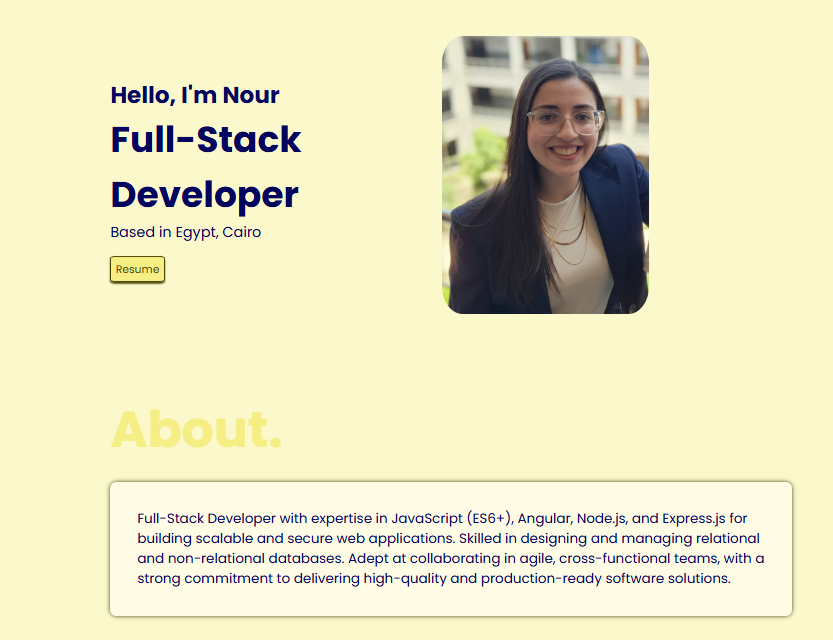

# 🌐 My Portfolio Website

Welcome to my **personal portfolio website**!  
This project showcases my skills, experience, and projects in a clean, modern, and interactive way.

## 🚀 Demo

You can view the live version here: **[Live Portfolio](https://your-portfolio-link.com)**



---

## 📋 Features

- **Responsive Design** – Fully optimized for desktop, tablet, and mobile.
- **Tabbed Sections** – Smooth transitions between **Skills**, **Experience**, and **Education**.
- **Interactive Dropdowns** – Expandable details under experience items for a cleaner UI.
- **Modern Styling** – Built with CSS variables, custom shadows, and subtle animations.
- **Accessible & Semantic HTML** – Clean structure for SEO and accessibility.

---

## 🛠️ Built With

- **HTML5** – Semantic structure
- **CSS3** – Custom variables, transitions, and flexbox layout
- **JavaScript (ES6)** – Tab switching, dropdown toggling, and animations

---

## 📂 Project Structure

```bash
.
├── index.html        # Main HTML file
├── styles.css        # Global styles and theme variables
├── script.js         # JavaScript for interactions (tabs, dropdowns)
├── public/           # Images, icons, and other resources
└── README.md         # You are here!
```
